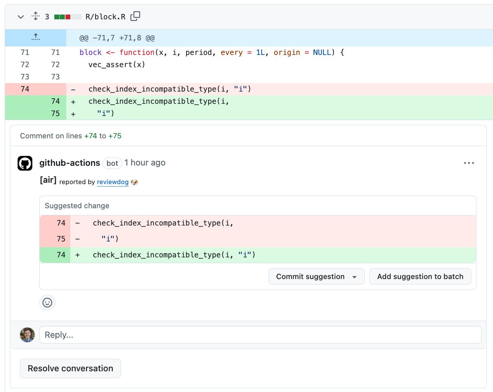

# setup-air

A GitHub Action to set up [Air](https://github.com/posit-dev/air).

- Installs Air
- Adds Air to the PATH
- Caches Air to speed up consecutive runs on self-hosted runners

## Contents

- [Inputs](#inputs)
- [Outputs](#outputs)
- [Example actions](#example-actions)
  - [Format with GitHub Suggestions](#format-with-github-suggestions)
  - [Format with `--check`](#format-with---check)
- [Customization](#customization)
  - [Run arbitrary Air commands](#run-arbitrary-air-commands)
  - [Install specific versions](#install-specific-versions)
  - [GitHub authentication token](#github-authentication-token)
- [Acknowledgements](#acknowledgments)

## Inputs

| Input | Description | Default |
|---------------|-------------------------------------------|---------------|
| `version` | The version of Air to install. See [Install specific versions](#install-specific-versions). | `latest` |
| `github-token` | The GitHub token to use for authentication. Generally not required. | `secrets.GITHUB_TOKEN` |

## Outputs

| Output        | Description                            |
|---------------|----------------------------------------|
| `air-version` | The version of Air that was installed. |

## Example actions

If you'd like to use Air to enforce style on your repository, use usethis to copy one of the following example actions from `examples/` into your `.github/workflows` folder.

### Format with GitHub Suggestions

```r
usethis::use_github_action(url = "https://github.com/posit-dev/setup-air/blob/main/examples/format-suggest.yaml")
```

This action runs `air format .` on every pull request.
If formatting is required, the check fails and suggestion comments are added directly to the pull request.
We recommend committing the suggestions in a single batch from the `Files changed` view, which will trigger a rerun of the check and delete the outdated suggestion comments.
Before using this action, ensure that you've locally run Air on your entire project at least once using `air format .` or the `Air: Format Workspace Folder` command in VS Code or Positron, otherwise you can end up with a very large amount of suggestions.



### Format with `--check`

```r
usethis::use_github_action(url = "https://github.com/posit-dev/setup-air/blob/main/examples/format-check.yaml")
```

This runs `air format . --check` on every push to `main` and on every pull request.
This is a very simple action that fails if any files would be reformatted.
When this happens, reformat locally using `air format .` or the `Air: Format Workspace Folder` command in VS Code or Positron, and commit and push the results.

## Customization

In the following subsections, we explore a variety of ways to customize `posit-dev/setup-air`.

### Run arbitrary Air commands

`posit-dev/setup-air` will install Air and add it to the PATH.
This means you can call Air in subsequent steps.

This performs `air format . --check` to ensure that changed code is correctly formatted.
The action fails if any changes are required.

``` yaml
- name: Install
  uses: posit-dev/setup-air@v1

- name: Check
  run: air format . --check
```

This actually formats the files, rather than performing a check:

``` yaml
- name: Install
  uses: posit-dev/setup-air@v1

- name: Format
  run: air format .
```

On a specific directory:

``` yaml
- name: Install
  uses: posit-dev/setup-air@v1

- name: Format
  run: air format ./directory
```

Note that if you combine this with another action to commit and push these reformatted files back to a branch or pull request, the push will [_not_ retrigger](https://github.com/orgs/community/discussions/25702) any of your GitHub Workflows.
This means you won't get any feedback that the push has fixed any broken formatting.
Instead, we recommend that you either reformat locally and push the changed files back up using a standard commit, or use the `format-suggest.yaml` example that adds suggestion comments to your pull request.
Both of these methods will retrigger your checks.

### Install specific versions

By default this action installs the latest version of Air.
You can also request a specific version, or a semver compatible range.

#### Install the latest version

``` yaml
- name: Install the latest version of Air
  uses: posit-dev/setup-air@v1
  with:
    version: "latest"
```

#### Install a specific version

``` yaml
- name: Install a specific version of Air
  uses: posit-dev/setup-air@v1
  with:
    version: "0.4.4"
```

#### Install a version by supplying a semver range

You can specify a [semver range](https://github.com/npm/node-semver?tab=readme-ov-file#ranges) to install the latest version that satisfies the range.

``` yaml
- name: Install a semver range of Air
  uses: posit-dev/setup-air@v1
  with:
    version: ">=0.4.0"
```

``` yaml
- name: Pinning a minor version of Air
  uses: posit-dev/setup-air@v1
  with:
    version: "0.4.x"
```

### GitHub authentication token

This action uses the GitHub API to fetch the Air release artifacts.
By default, the `GITHUB_TOKEN` secret is used, which is automatically provided by GitHub Actions.

If the default [permissions for the GitHub token](https://docs.github.com/en/actions/security-for-github-actions/security-guides/automatic-token-authentication#permissions-for-the-github_token) are not sufficient, you can provide a custom GitHub token with the necessary permissions.

``` yaml
- name: Install the latest version of Air with a custom GitHub token
  uses: posit-dev/setup-air@v1
  with:
    github-token: ${{ secrets.CUSTOM_GITHUB_TOKEN }}
```

## Acknowledgments

This is a fork of the great [ruff-action](https://github.com/astral-sh/ruff-action).
